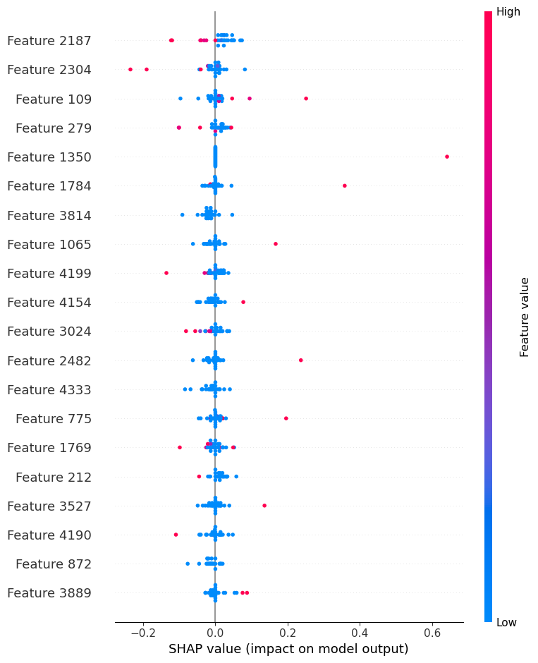

# Twitter-Sentiment-Analysis-Apple-vs.-Google

## 📌 Project Overview

This project aims to analyze Twitter sentiment about Apple and Google products using **Natural Language Processing (NLP)**. The goal is to build a machine learning model that classifies tweets as **positive, negative, or neutral**, helping businesses understand public perception.

## 🎯 Business Problem

Tech companies like Apple and Google rely on customer feedback to improve products and marketing strategies. An automated sentiment analysis system can help them track public sentiment in real-time, identifying trends and potential concerns.

## 📊 Dataset

- **Source**: CrowdFlower via Data.world
- **Size**: 9,093 tweets
- **Labels**: Positive, Negative, Neutral
- **Key Features**:
  - `tweet_text`: The actual tweet content.
  - `emotion_in_tweet_is_directed_at`: The brand or product mentioned.
  - `is_there_an_emotion_directed_at_a_brand_or_product`: Whether the tweet expresses sentiment.
  
## 🔎 Data Exploration

- **Common Words & Phrases**:
  
  
  - These visualizations highlight frequently used words and common word combinations in the dataset.

- **Sentiment Distribution**:
  - 
  - Displays the proportion of tweets categorized into positive, negative, and neutral sentiments.

## 🛠 Data Preprocessing

- Removed missing values and irrelevant columns.
- Text cleaning: Lowercasing, punctuation removal, and stopword filtering.
- Applied **tokenization** and **TF-IDF vectorization**:

```python
from sklearn.feature_extraction.text import TfidfVectorizer

vectorizer = TfidfVectorizer(stop_words='english', max_features=5000)
X_tfidf = vectorizer.fit_transform(df['cleaned_tweet'])
```

## 🧠 Modeling Approach

The following models were trained and evaluated:

- **Logistic Regression**
- **Support Vector Machine (SVM)**
- **XGBoost**

```python
from sklearn.svm import SVC
from sklearn.model_selection import train_test_split

X_train, X_test, y_train, y_test = train_test_split(X_tfidf, y, test_size=0.2, random_state=42)

svm_model = SVC(kernel='linear', probability=True)
svm_model.fit(X_train, y_train)
```

## 📊 Model Evaluation

- **Performance Metrics**: Accuracy, Precision, Recall, F1-score
- **SHAP Analysis** for feature importance and interpretability.

```python
from sklearn.metrics import classification_report

y_pred = svm_model.predict(X_test)
print(classification_report(y_test, y_pred))
```

### **Performance Overview**
- **Logistic Regression**: **96% accuracy**, effective but slightly weaker recall.
- **SVM**: Best model, achieving **98% accuracy** with high precision and recall.
- **XGBoost**: **92% accuracy**, balancing performance and interpretability.

- **SHAP Interpretability**:
  - 
  - 
  - 
  - These plots illustrate the most influential words in sentiment classification.

## 🔍 Key Insights

- **SVM outperformed all models**, offering the highest accuracy and robust classification.
- **SHAP analysis identified crucial words** driving sentiment classification.
- **XGBoost exhibited lower recall**, suggesting room for optimization.
- **Tweet Length Analysis**:
  - 
  - Shows the relationship between tweet length and sentiment classification.

## 🏁 Conclusion & Future Work

- **Conclusion**:
  - SVM is the best model for Twitter sentiment classification.
  - NLP techniques effectively distinguish consumer sentiment for Apple vs. Google.

- **Future Improvements**:
  - Real-time sentiment tracking for live tweets.
  - Deep learning models (LSTMs, Transformers) for enhanced predictions.
  - Fine-tuned handling of class imbalances.

## 🚀 How to Run the Project

### **Install dependencies**:
```bash
pip install numpy pandas scikit-learn xgboost shap
```

### **Run the notebook**:
1. Open **Jupyter Notebook** and run `index.ipynb`.
2. Follow the workflow to preprocess data, train models, and evaluate results.

## 📞 Contact

For questions or collaborations, reach out via **dafkiarie@gmail.com**.

